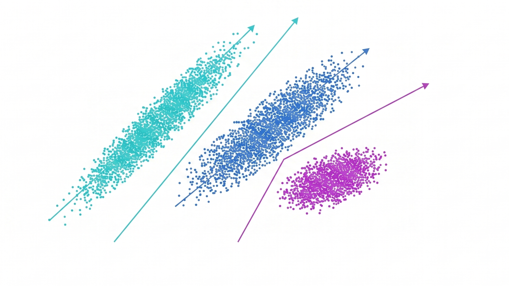
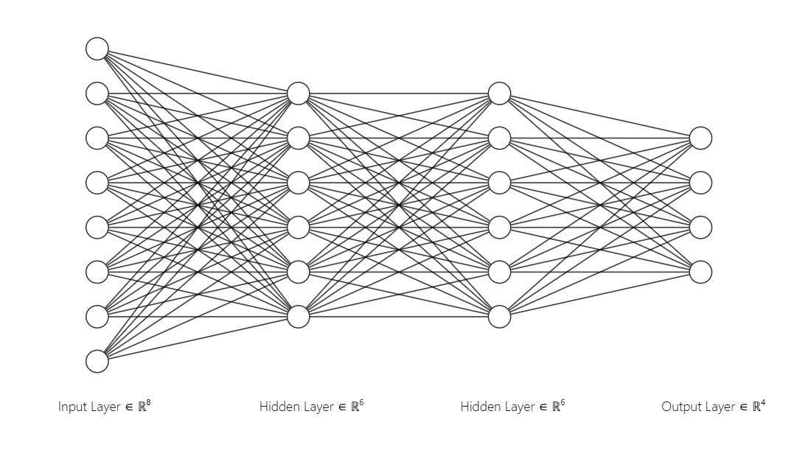

# Alejandro Pulido Sánchez

**Computer Engineer | AI & ML | Software Validation**

My professional experience is in embedded software validation and data engineering. My primary technical interest and current focus is transitioning into Artificial Intelligence and Machine Learning infrastructure.

### Tech Stack
* **Languages:** Python, C, SQL, Bash.
* **AI & Data:** TensorFlow, Keras, Scikit-learn, Pandas, NumPy, Snowflake, LangChain, PromptFlow, FAISS, Ollama.
* **Systems & Tools:** Linux, Git, GitLab CI/CD, CAN Bus, Automated Testing.

### Current Focus
Learning and researching AI Engineering and MLOps.

### Featured Projects

<table bordercolor="#30363d">
  <tr>
    <td width="50%" valign="top">
      <b><a href="https://github.com/AlePulSan/concurrent-quant-rag">Concurrent Quant RAG Engine</a></b>  
      An asynchronous RAG engine built for quantitative extraction of financial documents. Strictly decouples narrative semantic search (FAISS) from hard numerical extraction to eliminate LLM hallucinations and mathematical errors.  
      <i>Python • FAISS • Ollama • Streamlit • Asyncio</i>
    </td>
    <td width="50%" valign="top">
      
    </td>
  </tr>
  <tr>
    <td width="50%" valign="top">
      <b><a href="https://github.com/AlePulSan/JellyFlow-engine">JellyFlow Engine</a></b>  
      A hybrid computer vision engine built to simulate optical fluid physics and real-time refraction. Strictly decouples OpenCV's CPU processing from heavy tensor math handled by PyTorch/CUDA.  
      <i>Python • PyTorch • OpenCV</i>
    </td>
    <td width="50%" valign="top">
      
    </td>
  </tr>
  <tr>
    <td width="50%" valign="top">
      <b><a href="https://github.com/AlePulSan/Data-Mining-Systems">Data-Mining-Systems</a></b>  
      Technical repository focused on data mining and machine learning engineering. Features technical implementations of fundamental algorithms, modular processing pipelines, density-based clustering, and convolutional architectures.  
      <i>Python • Scikit-Learn • PyTorch • Pandas</i>
    </td>
    <td width="50%" valign="top">
      
    </td>
  </tr>
  <tr>
    <td width="50%" valign="top">
      <b><a href="https://github.com/AlePulSan/Machine-Learning-Algorithmic-Foundations">Machine-Learning-Algorithmic-Foundations</a></b>  
      Applied algorithmic foundations. Development of analytical and predictive models, including information theory applied to decision trees, parametric discretization, and custom implementations of multi-layer perceptrons and support vector machines.  
      <i>Python • NumPy • SciPy • Matplotlib</i>
    </td>
    <td width="50%" valign="top">
      
    </td>
  </tr>
</table>
